# Smart Email Management System

[](https://www.repostatus.org/#inactive)
[](https://www.python.org/downloads/)
[](https://www.djangoproject.com/)
[](https://www.postgresql.org/)

*Final Year Project: Leveraging Natural Language Processing and Data Analytics for Smarter Email Management Optimization or Advancing Email Productivity with Hybrid AI and Data Analytics*

This project delivers a modern, intelligent email management platform built with Django, combining machine learning, rule-based logic, and generative AI to help users focus on what matters. The system automatically prioritizes, categorizes, and summarizes emails, supports hands-free voice commands, and provides actionable analytics—all while ensuring privacy and scalability.

Link: [Read the project announcement on LinkedIn](https://www.linkedin.com/posts/lee-wen-kang-3b76b6188_fyp-finalyearproject-dataanalytics-activity-7331114077303345154-X-ZT?utm_source=share&utm_medium=member_desktop&rcm=ACoAACw97bsBncCETOMLZpB9FULMPgOBgDW6iBs) & [Watch a demo of the project on LinkedIn](https://www.linkedin.com/posts/lee-wen-kang-3b76b6188_fyp-finalyearproject-dataanalytics-activity-7331114077303345154-X-ZT?utm_source=share&utm_medium=member_desktop&rcm=ACoAACw97bsBncCETOMLZpB9FULMPgOBgDW6iBs)

---

## Contents
- [Motivation](#motivation)
- [System Overview](#system-overview)
- [Key Features](#key-features)
- [Data & Modeling](#data--modeling)
- [API Integrations](#api-integrations)
- [Setup](#setup)
- [How to Use](#how-to-use)
- [Database Schema](#database-schema)
- [Roadmap](#roadmap)
- [System Screenshots](#system-screenshots)
- [Contributing](#contributing)

---

## Motivation
Email overload is a persistent challenge for professionals. This project aims to transform the inbox experience by leveraging a hybrid AI approach combining robust machine learning models, domain-specific rules, and Generative AI to deliver reliable, context-aware email organization and insights.

---

## System Overview
The platform is architected for modularity and extensibility, with clear separation between data ingestion, processing, AI services, and user interaction.

System Architecture:

```
User Interface
  ├── Web UI (Inbox, Analytics, Compose, etc.)
  └── Voice Commands (Web Speech API)
      ↓
REST API (Django Backend)
      ↓
Email Logic & Orchestration
  ├── ML Models (Random Forest for Priority, XGBoost for Category)
  ├── Rule Engine (Domain-specific heuristics)
  ├── Generative AI (Gemini for Summaries/Replies)
  └── Vector Search (pgvector for semantic similarity)
      ↓
Database (PostgreSQL with pgvector)
```

---

## Key Features
- **Hybrid Priority Scoring:** Merges Random Forest predictions with a transparent rule-based engine for robust, real-world prioritization.
- **Automated Categorization:** XGBoost model classifies emails into actionable categories (e.g., Primary, Social, Promotions).
- **Generative AI Summaries & Replies:** Uses Google Gemini for summarizing threads and suggesting context-aware replies.
- **Voice-Driven Inbox:** Browser-based voice commands (Web Speech API) for hands-free navigation and actions.
- **Analytics Dashboard:** Visualizes trends, response times, and sender/recipient activity.
- **Semantic Search:** Finds similar emails using vector embeddings and pgvector.
- **Secure Gmail Integration:** OAuth2-based access for reading, sending, and managing emails.

---

## Data & Modeling
- **Data Sources:**
  - Enron Email Dataset (public, business context)
  - Anonymized, consented personal inbox data
  - Synthetic data for class balancing and edge cases
- **Preprocessing Pipeline:**
  - HTML/text cleaning, tokenization, lemmatization
  - Custom stopword removal, TF-IDF vectorization
- **Modeling:**
  - **Priority:** Random Forest classifier + rule-based adjustment
  - **Category:** XGBoost 
  - **Evaluation:**

    | Task      | Model    | Accuracy | F1-Score |
    |-----------|----------|----------|----------|
    | Priority  | RF       | 99%      | 1.00     |
    | Category  | XGBoost  | 84%      | 0.87     |

- **Hybrid Approach:**
  - ML models provide baseline predictions
  - Rule engine refines output using sender history, keywords, and context
  - Generative AI augments with summaries and smart replies

### Email Category Labeling & Balancing

The Enron dataset used in this project did not include category or priority labels, which posed a challenge for supervised learning. To address this, we used the Qwen2.5 large language model (LLM) to automatically generate consistent, context-aware labels for both email category and priority. Each email was passed through a structured prompt, and the model assigned one of several workplace-relevant categories, such as:

- Work or Business Email
- Finance & Transactions Email
- Personal Email
- Meeting & Schedule Email
- Spam Email
- IT Alerts & System Notifications Email
- Internal Policies & HR Updates Email
- Social Media Email
- Utilities Bill Email
- Promotions or Marketing Email
- Legal & Contractual Email

This LLM-based approach ensured high-quality, context-sensitive labeling, reducing human error and making the dataset suitable for training robust machine learning models.

**Balancing the Dataset:**
- Categories with more than 15,000 samples were capped at 15,000 (randomly selected)
- Smaller categories were kept as-is
- No synthetic samples were added, preserving the quality of text embeddings

Remaining imbalance was handled by using class weights during model training, ensuring the model learned to recognize minority categories effectively.

### Model Interpretability & Hybrid Adjustment

Despite high accuracy and F1-scores, detailed analysis revealed a consistent bias toward the Medium priority class—especially for borderline or ambiguous emails. To address this, a post-training probability adjustment layer was developed, refining model predictions using domain-specific signals such as:
- Urgency or risk keywords (e.g., “urgent”, “critical”, “failure”)
- Action verbs and deadline phrases (“due today”, “immediately”)
- Uppercase emphasis in subject lines
- Informational/courtesy phrases for Low priority (“FYI”, “reminder”)

This adjustment applies:
- Weighted scoring based on detected context
- Nonlinear scaling to boost or reduce probabilities (e.g., cubic boost for strong urgency)
- Class threshold logic to avoid over-assigning Medium unless other classes lack strong signals

This hybrid approach ensures the system delivers more reliable, human-aligned prioritization—especially in edge cases where pure statistical models may fail. The result is a practical, interpretable solution for real-world email management.

---

## API Integrations
- **Gmail API:** Secure email access and management
- **Google Gemini (Generative AI):** Summarization, smart replies
- **Google Cloud AI Platform:** Model deployment and scaling
- **pgvector:** Semantic search in PostgreSQL

---

## Setup
1. **Clone the repository:**
   ```bash
   git clone <your-repo-url>
   cd <project-directory>
   ```
2. **Create and activate a virtual environment:**
   ```bash
   python -m venv venv
   # Windows: venv\Scripts\activate
   # macOS/Linux: source venv/bin/activate
   ```
3. **Install dependencies:**
   ```bash
   pip install -r requirements.txt
   ```
4. **Configure environment variables:**
   - Copy `.env.example` to `.env` and fill in your credentials (Gmail, Gemini, DB, etc.)
5. **Start Docker services:**
   ```bash
   docker-compose -f docker/docker-compose.yml up -d
   ```
6. **Run migrations:**
   ```bash
   python manage.py migrate
   ```
7. **Launch the server:**
   ```bash
   python manage.py runserver
   ```

---

## How to Use
- **Login:** Use "Login with Google" (OAuth2) to connect your inbox.
- **Inbox:** View emails with AI-prioritized and categorized labels.
- **Voice Commands:** Click the mic icon and say commands like "Read the first email", "Reply", or "Compose".
- **Analytics:** Explore the dashboard for trends and insights.
- **Smart Replies:** Use AI-generated suggestions for quick responses.

---

## Database Schema
The main email table includes:
- id, user_email, subject, sender, recipients, date, snippet, has_attachments, attachments, star, label, folder, last_modified, priority, priority_score, priority_explanation, priority_last_updated, category, category_confidence, category_last_updated

---

## Roadmap
- [ ] On-demand summarization for long threads
- [ ] Sentiment analysis for emotional context
- [ ] One-click deployment scripts
- [ ] Enhanced analytics (e.g., cohort analysis)
- [ ] Real-time notifications for high-priority emails

---

## Future Work
Based on the findings and limitations of this project, several recommendations are proposed for future improvements:

1. **Improve OAuth Token Handling for Continuous Data Fetching:**
   - Enhance OAuth token management to reduce the need for frequent user reauthentication. Implement more efficient token refresh mechanisms or extend session handling for uninterrupted, real-time email fetching.

2. **Enhance AI-Generated Suggested Reply Quality:**
   - Improve the contextual relevance and accuracy of AI-generated replies by fine-tuning Gemini API models with domain-specific data or integrating multi-turn dialogue capabilities for more sophisticated responses.

3. **Strengthen Model Robustness for Ambiguous Emails:**
   - Expand the training dataset with more complex, real-world emails and collect user feedback to improve model learning. Explore advanced feature engineering (e.g., context-aware embeddings, hierarchical classification) to better handle challenging or borderline emails.

4. **Expand Voice Command Functionalities:**
   - Enable users to edit email content verbally and extend voice commands to other pages (e.g., Analytics Dashboard) for tasks like reading aloud key insights. Incorporate advanced speech-to-text features for improved accessibility and user experience.

5. **Optimize Data Preprocessing Using More Advanced LLMs:**
   - Use more powerful LLMs for dataset labeling, assuming improved computational resources, to produce higher-quality labeled data and improve model performance.

6. **Upgrade Deployment Infrastructure for Larger Models:**
   - Upgrade server hardware, expand storage, and ensure environment compatibility to support the deployment of more advanced machine learning models and realize their full potential.

---

## System Screenshots
1. **Login Page**
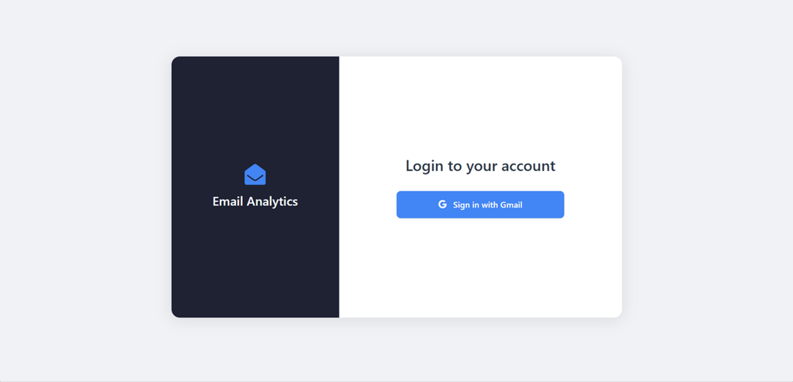   
2. **Dashboard Page**
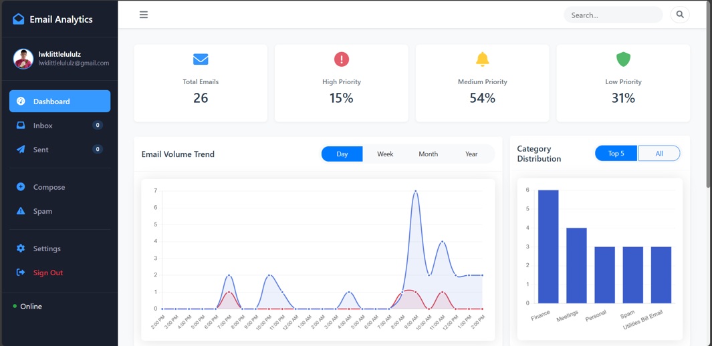
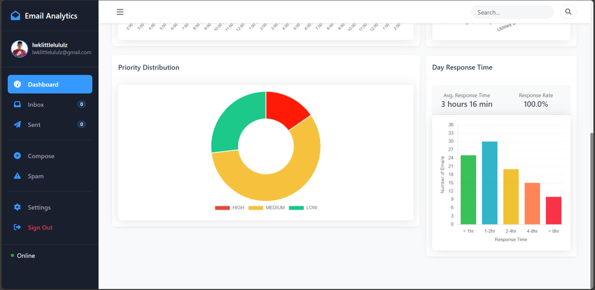
3. **Inbox Page**
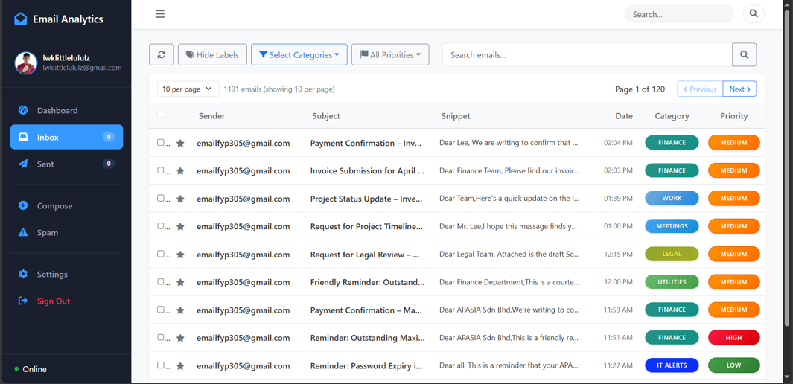
3. **Inbox Detail Page**
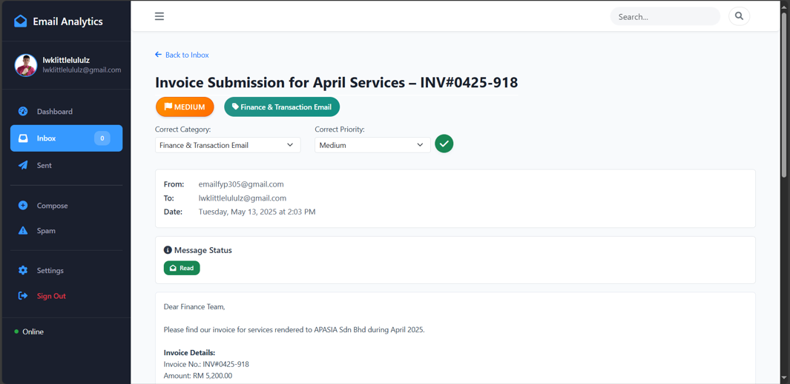
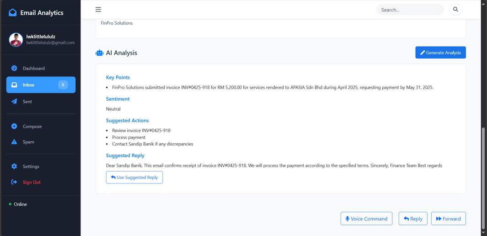
4. **Sent Page**
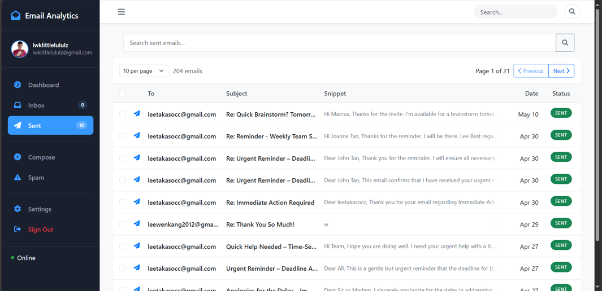
5. **Sent Detail Page**
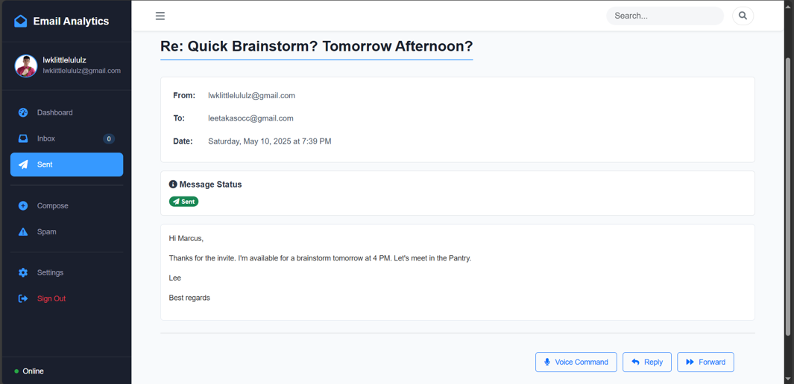
6. **Compose Window**
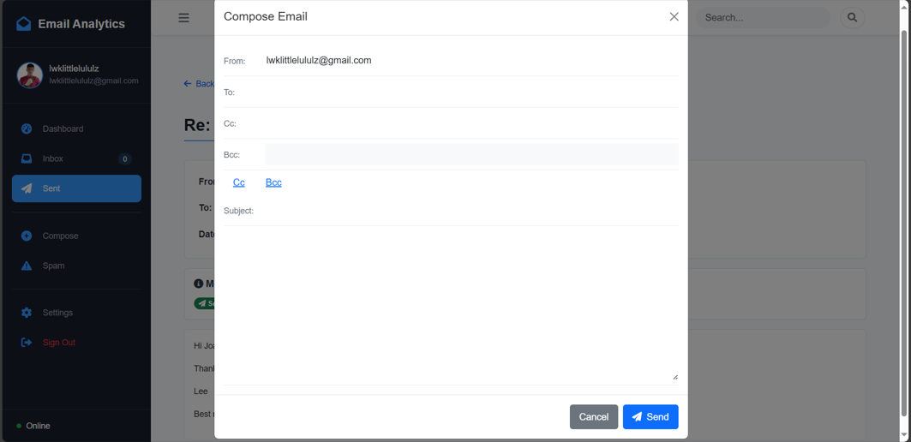
7. **Spam Page**
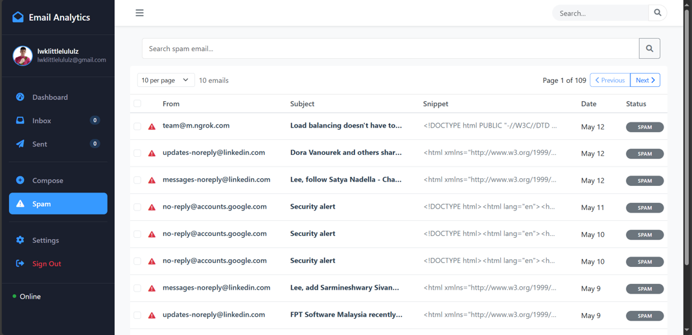
8. **Spam Detail Page**
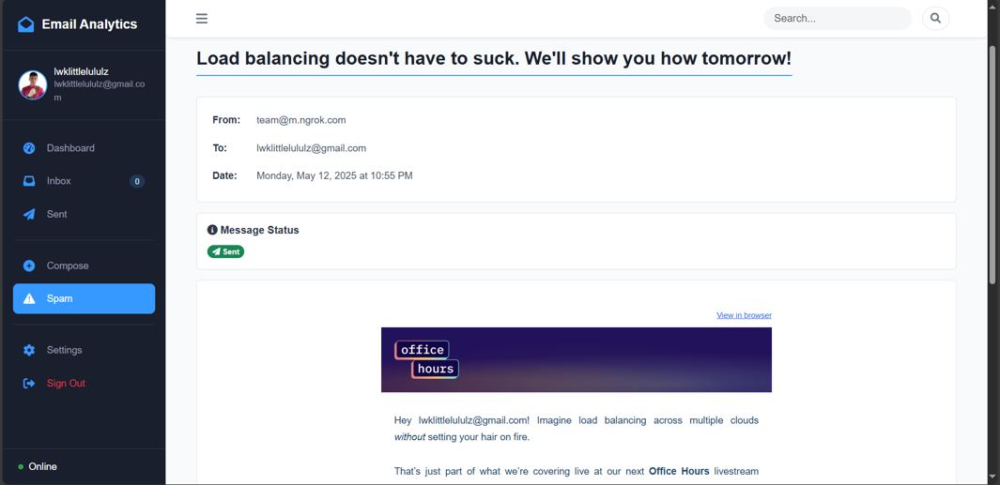
9. **Setting Page**
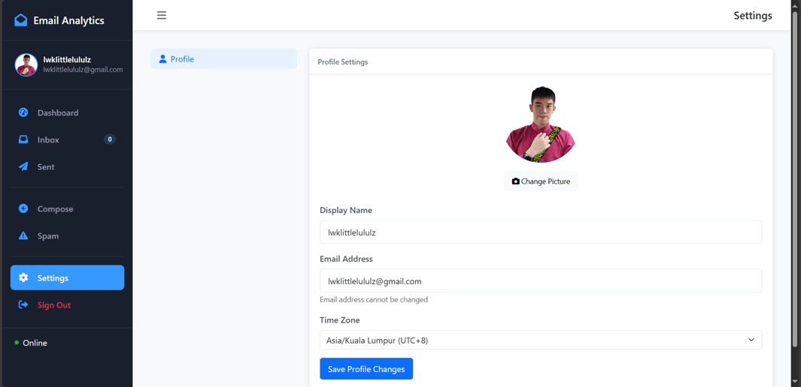


   

---

## Contributing
Contributions are welcome! Please open an issue or submit a pull request. All features are tested on a mix of real and synthetic data for reliability and privacy.

---

## Project Author

* **Lee Wen Kang**
* [Connect on LinkedIn](https://www.linkedin.com/in/leewenkang12/)
